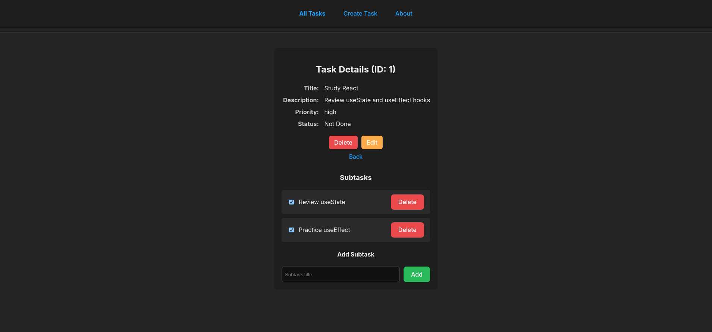
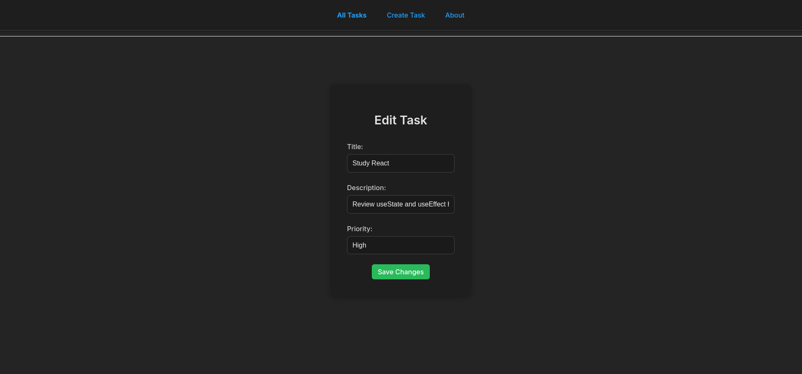

# REACT API JSON

A React application for task and subtask management, with data persistence via the `json-server` API.


## 📖 Project Description

This project is a simple task manager application built with React. It allows users to create, manage, and track tasks and subtasks. The app is designed to be lightweight, with data stored locally using `json-server`. It offers basic task management features, including task creation, deletion, and marking tasks as completed.


## 🚀 Features

- ✅ List all tasks
- ✅ Create new task
- ✅ Edit and delete tasks
- ✅ Mark task as completed (only if all subtasks are done)
- ✅ Add, complete, and remove subtasks
- ✅ Visual filter for completed/incomplete tasks
- ✅ Simple and responsive interface


## 📁 Folder Structure

```bash
src/
├── components/       # Reusable components
├── pages/            # Pages with routes (React Router)
├── assets/           # Images, icons
├── App.jsx           # Main app component
├── App.css           # Main CSS file for styling the app
└── main.jsx          # Entry point for the React application
```


## 🧩 Technologies Used

- React
- React Router DOM
- Axios
- json-server


## ⚙️ Installation

### 1. Clone the repository
```bash
git clone https://github.com/bdof2001/react-api-json
cd react-api-json
```

### 2. Install dependencies
```bash
npm install
```

### 3. Start the json-server API (port 3001)
```bash
npx json-server --watch api/db.json --port 3001
```

In a new terminal tab:
### 4. Start the React application (port 5173 or 3000)
```bash
npm run dev
```


## 🌐 Endpoints (JSON API)

### Tasks
- GET /tasks – list tasks
- POST /tasks – create task
- PATCH /tasks/:id – update task
- DELETE /tasks/:id – delete task

### Subtasks
- GET /tasks/:taskId/subtasks – list subtasks for a task
- POST /tasks/:taskId/subtasks – create subtask for a task
- PATCH /tasks/:taskId/subtasks/:subtaskId – update subtask (mark as completed)
- DELETE /tasks/:taskId/subtasks/:subtaskId – delete subtask


## 🧑‍💻 How to Use

- **Tasks Page:** Displays all tasks with their status (completed or not).
- **Task Detail Page:** Allows viewing details of a specific task, editing it, and marking subtasks as completed.
- **Create Task Page:** A form where users can create new tasks, specify their priority, and provide a description.
- **Edit Task Page:** A page where you can edit the task's title, description, and priority.
- **Subtasks:** Subtasks can be added to a task and marked as completed individually.

## 🖼️ Screenshots 

### Tasks Page


### Task Detail Page


### Create Task Page


### Edit Task Page

